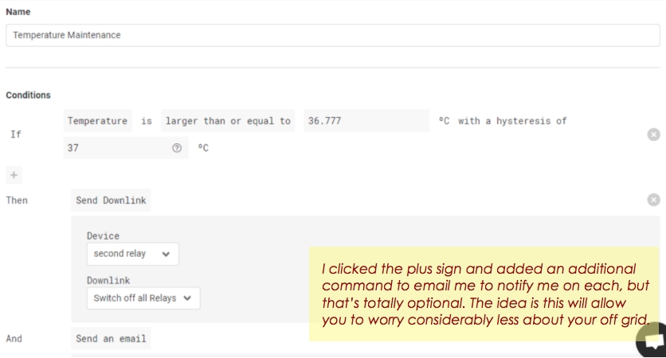
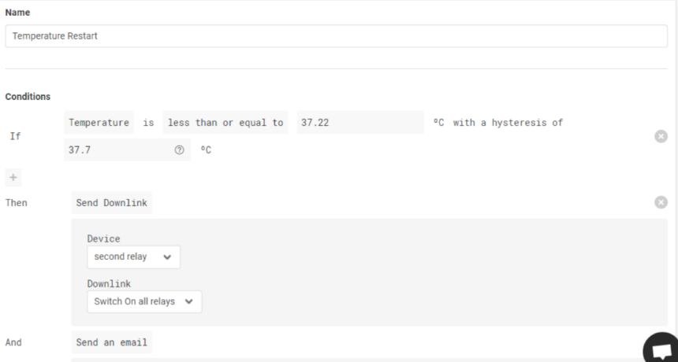
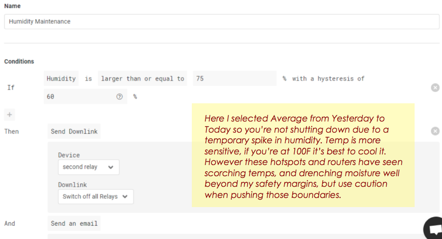
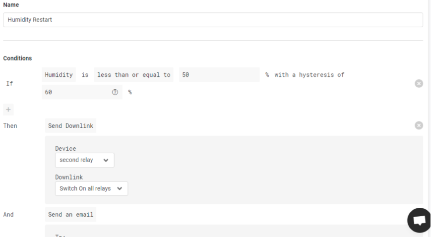
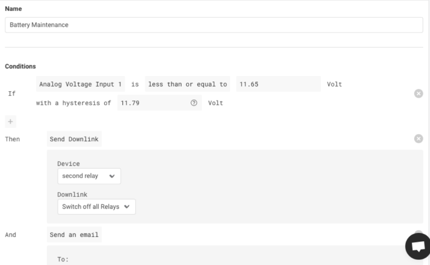
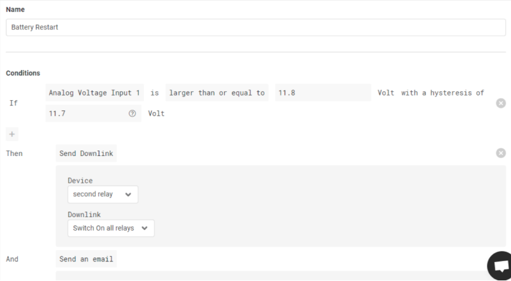

<!DOCTYPE html>
<html lang="en" dir="ltr">
  <head>
    <meta charset="utf-8">
  </head>
  <body>
    <h1>Datacake Battery / Temperature /Humidity Rules for Hardware Safety</h1> 
    <h3>Highly Reccomended <i>Feel free to edit integers to your discretion.</i></h3>
    
These rules will instruct your LT to power down your miner and router due
to low battery or high temp/humidity, as well as turn them back on when it
is safe to do so. The LT can operate on as ittle as 7 volts, which will keep
you in control of your hardware even if the voltage is too low to power the
12v solar controller. This will prevent your miner/router from repeatedly
killing the battery in low solar environments, potentially damaging your
battery, or costing you expensive hardware failure due to heat or moisture.

     
    <h4>You’ll select each device / parameter specifically, make the appropriate selection.</h4>
    
    
    
    
    <h4>These two are for the LT itself</h4>
    
    
    <h4>That’s it. Hopefully that saves you a lot of stress, a little headache, and a ton of
money. There are endless combinations of sensors and rules you could come up with, be clever. The
more sensors the better. Water detection sensor, door open/close sensor, etc… 
    </h4>
  </body>
</html>
