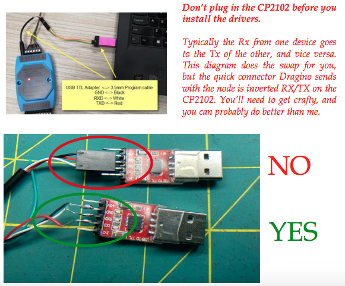
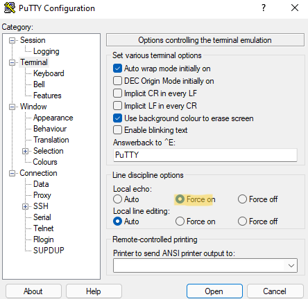
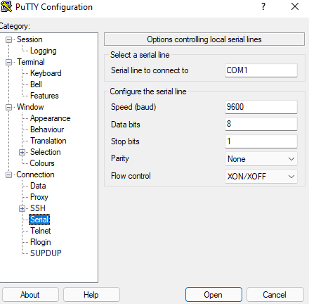
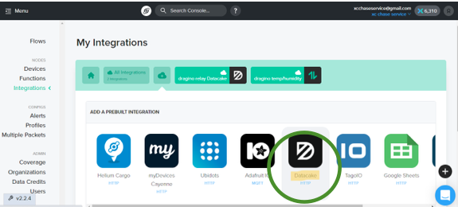
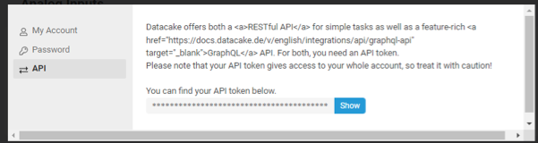
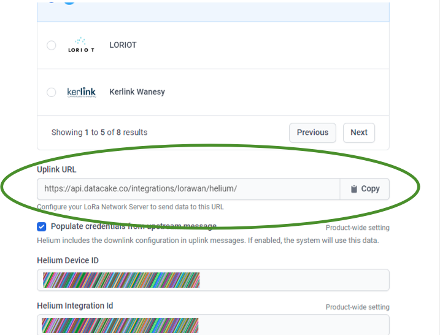
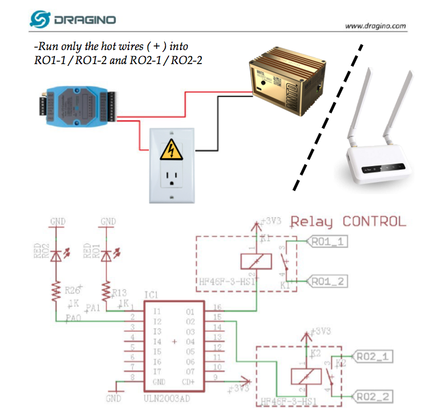

<!DOCTYPE html>
<html lang="en" dir="ltr">
  <head>
    <meta charset="utf-8">
  </head>

  <body>
    <h1>Dragino I/O Relay LT-22222-L Walkthrough</h1>
    
for US/AU915mhz

    
For remote power cycle of 1 or 2 devices
      and voltage monitoring over LoRaWAN

    
by @tanny7241 with special thanks to @tteague#3838 (Updated May 7th, 2022)

    
<i>Addtional folder in this repo for walkthrough to create rules for temp/humidity and battery safety using Datacake</i>
  
      The Dragino LT-22222-L ships as a Class C device. For Helium, we need to change that to Class A. In additon, the default settings for US/AU915mhz, as well as for CN470, are to lazily scan all 72 potential channels in your region’s band, when most LoRaWAN gateways only use 8. When the device joins, the server will issue a downlink telling the device how to behave. I’ve included links to the, USB converter, driver and application you’ll need in this walkthrough to make your life a little easier.</h4> 
      
End Goals:

    <ul>
      <li>
        Set the device from Class C to Class A so it can work with Helium
      </li>
      <li>
        Configure the end node to work in sub-band 2
      </li>
      <li>
        Join the Helium Network
      </li>
      <li>
        Control the relay on Datacake
      </li>
      <li>
        Wire the node for power relay and voltage monitoring
      </li>
    </ul>
    

    
ALWAYS USE CAUTION WHEN WORKING WITH ELECTRICITY. NEVER PLUG WIRES DIRECTLY INTO A SOCKET, ALWAYS USE A DC ADAPTER RATED FOR YOUR DEVICE.

    
You Will Need:

    <ul>
      <li>
        The Dragino LT-22222-L, in your region's band, antenna attached
      </li>
      <li>
        The 1/8" programming plug it comes with
      </li>
      <li>
        12v power supply, wired Hot to VIN, Neutral to GND.
      </li>
     
Which wire is positive on 12v adapter?

    
If the multi-colored wire is black and red, the black wire is the negative wire, while the red one is positive. If both wires are black but one has a white stripe, the positive wire <i>should</i> be the one with the white stripe, and the negative wire <i>should</i> be black. RECOMMENDED: TEST WITH VOLTMETER 

    
    

    

      <li>
        A USB to TTL Converter, use a <a href="https://www.amazon.com/IZOKEE-CP2102-Converter-Adapter-Downloader/dp/B07D6LLX19/ref=sr_1_3?keywords=usb+to+ttl+adapter&qid=1647726342&sr=8-3" target="_blank">CP2102</a> if you want to match the walkthrough:  
    
      </li>
      <li>
        Download and install <a href="https://www.pololu.com/docs/0J7/all" target="_blank">the USB drivers</a> for the CP2102
      </li>
      <li>
        Download and install <a href="https://www.chiark.greenend.org.uk/~sgtatham/putty/latest.html" target="_blank">PuTTY</a>
      </li>
      <li>
        Connect the programming cable to USB adapter, plug in and power the LT-22222-L 
        (Node < headphone w/ quick connect > CP-2102 > PC)
      </li>
    </ul>
      </h4>

First, navigate to your Device Manager to find the COM port for your device

    

    

Open Putty. Click "Serial" under connection type and type in the COM port provided to you in Device Manager. ("COM3" in the example)

    
Click "Terminal" under "Category" and select Local Echo: "Force On"

    
    
Click "Serial" under "Category", make sure it looks like this, it should already:
 
 
Baud Rate :9600 
Data Bits: 8 
Stop Bits: 1 
Parity: None 
Flow Control: XON/XOFF 
    

    
    
Click "Open"

      
<i>Below is a preview of the AT terminal. Fun fact, AT commands are called that because ATtention.</i>

    
    
<i>Do not hit backspace in the terminal. If you make a mistake, close the window and start again.</i>

    
The default password is "123456", when <tt>Incorrect Password</tt> appears, just type <tt>123456</tt> and hit enter. 
    If you get an error message, just enter the command again, and if it interrupts your commands with a Tx/Rx feed while you're typing, wait for it to stop, and enter the command again: 
        Follow this dialogue carefully,  
    

    
Enter the default password  
      
      123456 
      
<tt>Correct Password</tt>  
      
      ATZ
      
 
  <tt>DRAGINO XX Device</tt> 
    <tt>Image Version: XXX…</tt> 
      <tt>Frequency Band: XXX… </tt>  (Make sure the band reflects your region's) 
<tt>DevEui= XX XX XX XX XX XX XX XX</tt> 
<tt>Enter Password to Active AT Commands</tt> 
<tt><i>followed by the Tx and Rx information</i></tt>  
      
      AT+CLASS?
      
<tt>AT+CLASS: Get or Set the Device Class</tt>  
      
      AT+CLASS=A
      
<tt>OK</tt>  
      
      AT+CHE?
      
<tt>AT+CHE: Get or Set eight channels mode, Only for US915,AU915,CN470</tt>  
      
      AT+CHE=2
      
<tt>OK</tt>
      
      ATZ?
      
<tt>OK</tt>  

  
<i>Enter this last command, and check the indicated lines</i>
  
      
      AT+CFG
      
<tt>Stop Tx events, Please wait for all configurations to print</tt> 
<tt>AT+DEUI=1234567890123…</tt> 
<tt>AT+DADDR=123456789012…</tt> 
<tt>AT+APPKEY=12345678901…</tt> }These will all be unique to your device 
<tt>AT+NWKSKEY=1234567890…</tt> 
<tt>AT+APPSKEY=1234567890…</tt> 
<tt>AT+APPEUI=12345678901…</tt> 
<tt>AT+ADR=1</tt> 
<tt>AT+TXP=0</tt> 
<tt>AT+DR=4</tt> 
<tt>AT+DCS=0</tt> 
<tt>AT+PNM=1</tt> 
<tt>AT+RX2FQ=923300000</tt> 
<tt>AT+RX2DR=8</tt> 
<tt>AT+RX1DL=1000</tt> 
<tt>AT+RX2DL=2000</tt> 
<tt>AT+JN1DL=5000</tt> 
<tt>AT+JN2DL=6000</tt> 
<tt>AT+NJM=1</tt> 
<tt>AT+NWKID=00 00 00 00</tt> 
<tt>AT+FCU=0</tt> 
<tt>AT+FCD=0</tt> 
<tt>AT+CLASS=A</tt><i> Yours says CLASS A?</i> 
<tt>AT+NJS=0</tt> 
<tt>AT+RECVB=0:</tt> 
<tt>AT+RECV=0:</tt> 
<tt>AT+VER=v1.5.6 US915</tt></> Yours says US915?</i> 
<tt>AT+CFM=0</tt> 
<tt>AT+CFS=0</tt> 
<tt>AT+SNR=0</tt> 
<tt>AT+RSSI=0</tt> 
<tt>AT+RJTDC=20</tt> 
<tt>AT+RPL=0</tt> 
<tt>AT+TDC=600000</tt> 
<tt>AT+PORT=2</tt> 
<tt>AT+RX1WTO=83</tt> 
<tt>AT+RX2WTO=7</tt> 
<tt>AT+CHS=0</tt> 
<tt>AT+CHE=2</tt><i> Yours says 2?</i> 
<tt>903.9 904.1 904.3 904.5 904.7 904.9 905.1 905.3</tt> 
<tt>AT+PWORD=123456</tt> 
<tt>AT+MOD=1</tt> 
<tt>AT+TRIG1=0,0</tt> 
<tt>AT+TRIG2=0,0</tt> 
<tt>AT+VOLMAX=0,0</tt> 
<tt>AT+COUTIME=600</tt> 
<tt>AT+ADDMOD6=0</tt> 
<tt>AT+DTRI=0,0</tt> 
<tt>AT+AVLIM=0,0,0,0</tt> 
<tt>AT+ACLIM=0,0,0,0</tt> 
<tt>AT+ATDC=5</tt>  
 

<i>If so, then you’re done. If any of yours look different, enter the related command again.</i>

Once you’re done click the computer icon in the top left corner and click "Copy all to Clipboard." Paste in a text editing app. [Delete the spaces in your Keys/EUIs to make copy and pasting them a breeze.]
 
 
Pat yourself on the back, hacker. You've finished the hard part. 
 
You can close the Putty window
  Unplug the LT-22222-L
[Vital step here, because the join uplink is sent when the device powers on.]

  <h2>Using the Relay</h2>
  <ul>
    <li>
      Go to <a href="https://console.helium.com/welcome" target="_blank">console.helium.com</a> [Create an account if it's your first time] 
    </li>
    <li>
      Add a device using the AppEUI, DevEDUI, and APPKey provided with your LT-22222-L, <i>or that you hopefully just copied from Putty into a text app. Don't forget to delete all spaces in your Keys/EUIs.</i> (There is a pending state when adding the device and you will not see any data flow/joins/etc.during this period. Wait about 20 minutes to power it on)
    </li>
    <li>
      Power on the device and scroll to the device Event Log at the bottom of the device’s page to confirm you got the Uplink, it should be nearly simultaneous with a downlink.<i>Welcome to the Helium network! You did it  :)</i>
    </li>
    <li>In a separate tab or window, go to <a href="https://datacake.co/" target="_blank">datacake.co</a>
    </li>
  </ul>
  
Navigate to your <a href="https://app.datacake.de/" target="_blank">Datacake dashboard</a> and add the device: Select “LoRaWAN” / “Helium”

  
  
  
  
Now navigate back over to your Helium Console and click “Integrations” > “Add Integration” > “Datacake HTTP”

  
  
Navigate back to your Datacake dashboard and click your user name in the top left corner > click “Edit Profile” > “API” > “Show Token” > Now copy that token to your clipboard.

  
  
and paste it to the “ENDPOINT DETAILS” in your Helium Integration

  
  
Navigate back over to Datacake and click “Configuration”> Scroll down to “Network Server” and click “Change” > Scroll down to your “Uplink URL” and copy it to your clipboard.

  
  
Navigate back over to Helium Console and click “Integrations” > Select your LT-22222-L > Scroll down to “Endpoint URL” and paste the “Uplink URL” you just copied from Datacake and click “Update Details”

  
  
Click “Flows” > “+ Nodes” > Drag your device out of that menu and it'll stick to the background, do the same with your datacake integration.

  
  
Now connect the dots! Click to draw a line connecting the two. It should appear dotted indicating data flow. This is how your Flows board will work for all integrations. <i>It’s sexy, isn't it?</i>

  
Navigate back over to your Datacake dashboard and click “Downlinks” and click “Switch on all Relays”. You should receive a message that says “Downlink sent to the LNS successfully”

  
  
Go over to Helium Console, click “Devices” > LT-22222-L > and scroll down to your “Event Log” and make sure you see a red Downlink Queued.

  
  
It could take around 10 minutes for you to see the RO1 and RO2 lights on your LT-22222-L illuminate. If they do, you’re all done!

  
<i>If you are not getting the downlinks, the easiest thing to do will be to remove the device from Helium console, and start over. You’ve got this!</i>

  <h2>Relay Wiring Configuration-</h2>
  
  
Note the use of a socket in this diagram is for illustrative purposes only. USE CAUTION WHEN WORKING WITH ELECTRICITY. DO NOT PLUG WIRES DIRECTLY INTO A SOCKET, ALWAYS USE A DC ADAPTER RATED FOR YOUR DEVICE.

  
  
<i>The steps below apply specifically to the off-grid configuration provided in an https://www.iotoffgrid.com/ solar enclosure kit. The LT-22222-L can be powered directly by a 7-24v DC adapter for on-the-grid indoor and enclosure applications.</i>

  
  
The black wires don’t need to be cut. If they are, splice/crimp carefully.</>
  <ul>
    <li>
      Power off
    </li>
    <li>
      Daisy chain batteries together with charging splitter (if  >1) [img next page]
    </li>
    <li>
      Connect 1 battery lead to solar controller
    </li>
    <li>
      Connect opposite battery lead to LT-22222-2 (+VIN,-GND)
    </li>
    <li>
      Connect appliance lead from controller to regulator
    </li>
    <li>
      Run the ( + ) miner wire into RO1-1 and out RO1-2 to miner
    </li>
    <li>
      Run the ( - ) miner wire from controller to miner
    </li>
    <li>
      Run the ( + ) router wire from regulator to RO2-1 and out RO-2 to router
    </li>
    <li>
      Run the ( - ) router wire from regulator to router
    <li>
      *OPTIONAL: analog voltage monitoring (battery voltage)
      $nbsp <12” ~14-16 AWG wire from ( + ) battery input of controller to AVI1
    </li>
  </ul>
  
  
<i>This is the recommended configuration provided by @Pirate_ProfTK#1062 for the 2 battery / splitter / controller / LT. Chances are you’ll need to cut the plug off the lead to the LT and splice a <12” ( + ) and ( - ) wire to power the LT-22222-L</i>

   
  
The image below illustrates how to wire the LT-22222-L on-the-grid with wall power supply for the node and miner. Repeat the process for the router. 

  
  
Datacake will allow you to control the Relays individually, but it’s easier to select “All On” or “All Off” from the provided Downlinks. The device sends its uplink every 10 minutes or so, you will not get an immediate response from your relay. The ON and OFF packets are different Downlinks and they should be sent one at a time. I will be updating this walkthrough with any corrections, as well as the code I’m trying to develop for a custom downlink to power cycle with a single command. Wish me luck!

   
  
The stock antenna did not cut it in my first deployment. If you were planning on placing your LT indoors, perhaps consider putting the LT in an outdoor enclosure instead, or running coax to an aftermarket antenna.

  
<i>When you do cable runs, think ‘teapot’- short, and stout. Thicker cable for antennas has better insulation against static accumulation, and thicker cable for electrical systems means less voltage drop.</i>

   
  
<i>Eample of a custom enclosure by @tteague: </i>

  
  
The piece you'll need to upgrade the antenna is pictured below. it’s called “IPD/u.fl to N Type” You can also use the existing SMA out with an adapter. You’ll replace the pigtail on the board like a snap button on your pants, pop it off, snap it on.

  
<i>EDIT: The IPEX/u.fl cable I ordered did not fit the ufl board on the LT. The next easiest solution is to simply order an SMA adapter that matches your cable configuration. The SMA out on the LT is an SMA Female (Not reverse polarity, like on a RAK miner for example)</i>

  
  
<i>If your LT will be in sparse LoRaWAN coverage or indoors, highly consider running an aftermarket antenna. Any antenna that would work on your Helium miner would work on the LT, just be sure it’s in your region’s band.</i>

   
  
Now you've got this incredible tool at your fingertips, if your internet has been down and needs a reboot, your miner could probably benefit from a power cycle refreshing the snapshot. So if your router is offline and unresponsive, or if your miner gets stuck, and is behind by 2000-2500 blocks or so, cowboy boot those babies! <i>Do not abuse the ability to power cycle your hardware, never do so more than once a day.</i>

   

<i>EDIT: On May 11th, hotspots will no longer have to sync with the blockchain! </i>	&#127880; 
 
  
Thanks for sticking through this walkthrough. Hopefully it helps you, if you got stuck anywhere along the way or have any questions, I'm @tanny#7241 on Discord, and @iLoveSpectra on Twitter.

   
  
If you’re feeling grateful, my HNT wallet address is provided below:

  <h4>14fjXeSHN1t9f1TJLX5zWVC1P8iVPZ2M96Ke6iFDPwjkxvK3fZq</h4>
  
   
  
<i>Hopefully you’ve reached the end of this walkthrough for the first time without having even ordered your LT-22222-L yet. If you haven't used the Helium network by creating applications on Helium Console for LoRaWAN sensors, there's no need to start with this I/O Relay. There are countless sensors with limitless applications that allow you to nitpick every element of the physical environment, almost anywhere. The steps <a href="https://github.com/ilovespectra/ilovespectra/tree/main/LT-22222-L#using-the-relay" target="_blank">Using the Relay</a> are the same for any node, just follow the bread crumbs from your makers. Every off-grid, or even every out-door enclosure period, should be equipped with a temperature/humitidy sensor. Electronics are prone to static under 30% humidity, and moisture issues over 50%. Tow that fine line and you'll extend the life of your hardware by years.</i>

      
  </body>

</html>
