<!DOCTYPE html>
<html lang="en" dir="ltr">
  <head>
    <meta charset="utf-8">
  </head>

  <body>
    <h2>RAK4631 Weather-Monitor <i>Additional Help</i></h2>
    
<i>Information to help setup a weather monitor (US915) using the RAK4631 and the walkthrough provided by RAK.</i>

    
First things first, head on over <a href="https://github.com/RAKWireless/WisBlock/tree/master/bootloader/RAK4630" target="_blank">here</a> to get your RAK4631 all setup with the latest bootloader. Next, proceed with the steps in <a href="https://github.com/RAKWireless/RAKwireless-Arduino-BSP-Index" target="_blank">this walkthrough</a> to setup RAK board support in Arduino IDE. Lastly, follow  
      <a href="https://github.com/RAKWireless/WisBlock/tree/master/examples/RAK4630/solutions/Weather_Monitoring" target="_blank">this walkthrough</a>. 
      It will help you physically assemble the weather sensor and provide the last remaining software you'll need. You can stop when you reach this point of the walkthrough:
 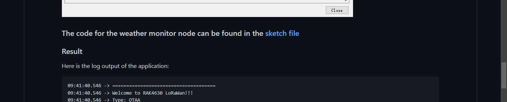 
I use Arduino IDE for this walkthrough as does the RAKWireless Weather Monitoring Solution walkthrough above.
      Once you've got the monitor assembled and everything all set on Arduino IDE, you're ready to begin editing your code.

   
Head over to <a href="https://console.helium.com/" target="_blank">Helium Console</a> and setup an account if you 
      don't have one yet. Click "Add New Device" and enter a name for your Weather-Monitor.  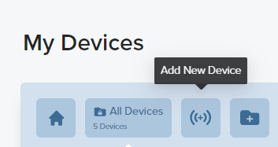 Copy and paste your DevEui, AppEui, and AppKey into a text editing app and 
      save the file as something like "Weather Monitor Keys".  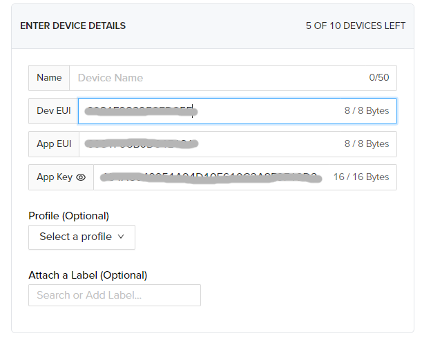   The Weather Monitoring walkthrough above provides you with <a href="https://github.com/RAKWireless/WisBlock/blob/master/examples/RAK4630/solutions/Weather_Monitoring/Weather_Monitoring.ino" target="_blank">this sketch</a>. You can edit the sketch yourself using the following instructions, or skip to <a href="https://github.com/ilovespectra/ilovespectra/tree/main/RAK4631/Weather-Monitor#using-preset-packages" target="_blank">Using Preset Packages</a> for an <a href="https://github.com/ilovespectra/ilovespectra/blob/main/RAK4631/Weather-Monitor/Weather-Monitor-US915.ino" target="_blank">Arduino sketch</a> preconstructed for the US915 band and the <a href="https://github.com/ilovespectra/ilovespectra/blob/main/RAK4631/Weather-Monitor/Datacake%20Decoder" target="_blank">Datacake Decoder</a>. In order to modify the code yourself, simply copy and paste the raw contents from the Weather-Monitor.ino into your Arduino IDE, it should look like this:

    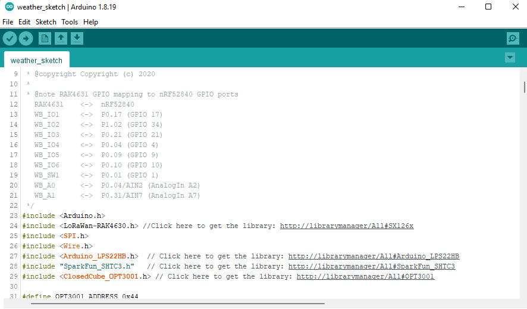
    
<b>Here are the things you'll need to modify:</b>  Replace line 48 with:

    
    #define LORAWAN_DATERATE DR_3
    
   
Replace line 51 with:

    
    DeviceClass_t g_CurrentClass = CLASS_A;

   
Replace line 52 with:

      
    LoRaMacRegion_t g_CurrentRegion = LORAMAC_REGION_US915;
      
   
Lines 73, 74, and 75 are to be filled in using the Euis/Keys you saved from Helium Console earlier. Only replace the blank areas indicated below:

     
     uint8_t nodeDeviceEUI[8] = {0x__, 0x__,...};
     uint8_t nodeAppEUI[8] = {0x__, 0x__,...};
     uint8_t nodeAppKey[16] = {0x__, 0x__,...};
    
 
Lines 45-54 should look like this:

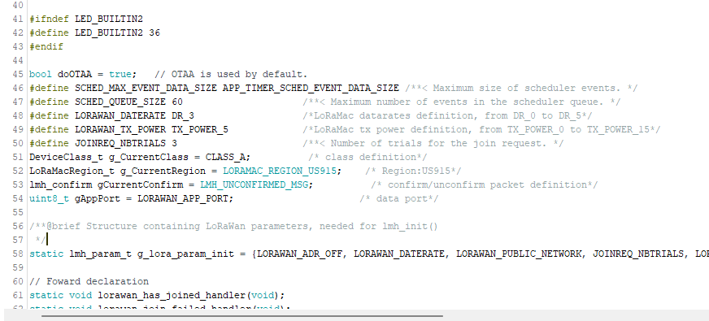
      <h3>Compile the Weather-Monitor Arduino Sketch</h3>
      
Click the check in the corner to verify, or compile, the sketch. You shouldn't receive any errors. If you do, simply use the debug at the bottom of the application to track down your typo. Once your sketch is verified, click the arrow to Upload to your device and wait for it to finish programming.
     
 <h2>Configuring Datacake</h2>
    
We'll be using <a href="https://datacake.co/" target="_blank">Datacake.co</a> to read the data from our sensor. Head over and create an account if you don't have one already.

    
Navigate to "Devices" and select "Add Device"
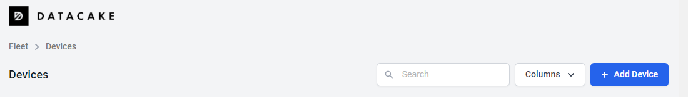 Select "LoraWan" > "RAK Wisnode Starting Template" > "Helium"
 
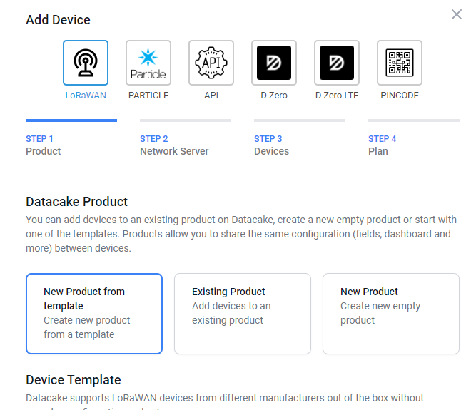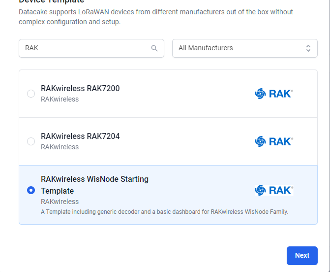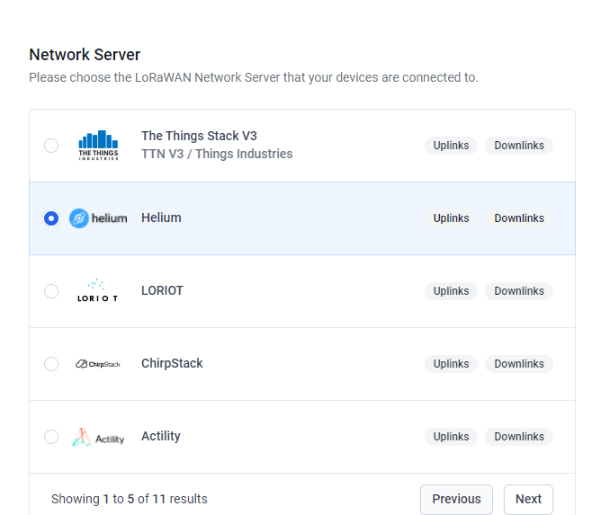
    
Then enter your Device EUI, give it a name, and click "Next".
 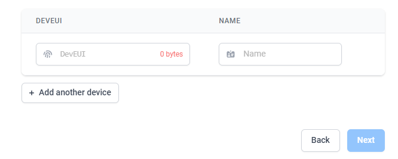 

Navigate to Configuration and down to your Decoder. Scroll down to line 60 of your Decoder, replace it with '}' and hit enter. Paste the following function:

    function Decoder(bytes, port) {
    var decoded = {};

    decoded.temperature = (bytes[1] << 8 | (bytes[2])) / 100;
    decoded.humidity = (bytes[3] << 8 | (bytes[4])) / 100;
    decoded.pressure = (bytes[8] | (bytes[7] << 8) | (bytes[6] << 16) | (bytes[5] << 24)) / 100;
    decoded.light = bytes[12] | (bytes[11] << 8) | (bytes[10] << 16) | (bytes[9] << 24);

    return decoded;

  
Place another '}' below, and hit enter again. It should look like this:
 
    <h3>Save the Decoder</h3>
    
Once you've edited the decoder to include the function above, just hit save! Now you can proceed with Setting up your Datacake Dashboard below. 

    <h2>Using Preset Packages</h2>
    
Rather than editing the codes yourself, you can use a <a href="https://github.com/ilovespectra/ilovespectra/blob/main/RAK4631/Weather-Monitor/Weather-Monitor-US915.ino" target="_blank">Arduino Sketch</a> that's been modified for US915, and the <a href="https://github.com/ilovespectra/ilovespectra/blob/main/RAK4631/Weather-Monitor/Datacake%20Decoder" target="_blank">Datacake Decoder</a>.
 
Simply copy the raw contents from the link for the 'Arduino Sketch' and paste it into Arduino IDE in order to enter your devices info. <b>You'll still need to add your OTAA DevEui, AppEui, and AppKey beginning in line 73 in the Arduino sketch.</b> Then you just have to <a href="https://github.com/ilovespectra/ilovespectra/tree/main/RAK4631/Weather-Monitor#compile-the-weather-monitor-arduino-sketch" target="_blank">compile</a> and verify the sketch and upload it to your weather monitor. Then copy the raw contents of the 'Datacake Decoder', navigate to your Configuration window on your Datacake console, scroll down to decoder and post the contents and hit save.

    <h3>Setting up your Datacake Dashboard</h3>
    
If you used the preset packages, follow the steps above for  <a href="https://github.com/ilovespectra/ilovespectra/blob/main/RAK4631/Weather-Monitor/README.md#configuring-datacake" target="_blank">Configuring Datacake</a>  and return here after you add your Device. In your Configuration window on Datacake, scroll down past your Decoder in your "Fields" to "Temperature" and select "Add Mapping Field"
 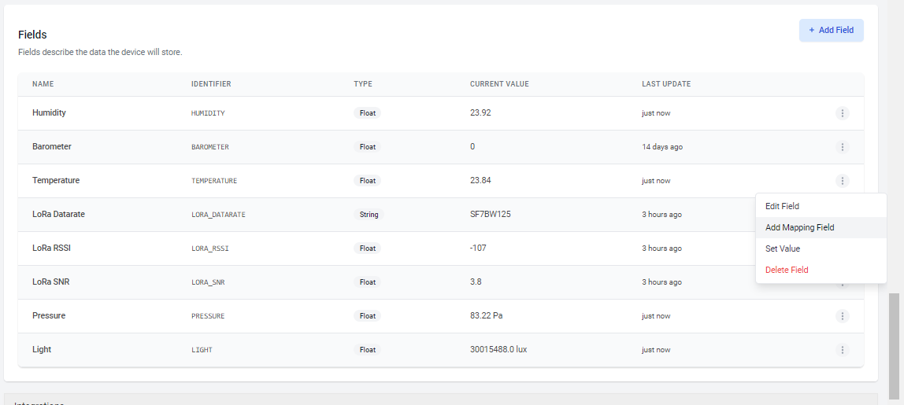 

Enter the following information: "Type"- Float, "Name"- <i>any, ie. Temperature Fahrenheit</i>, "Source"- set 0 to 100, "Target"- set 32 to 212 
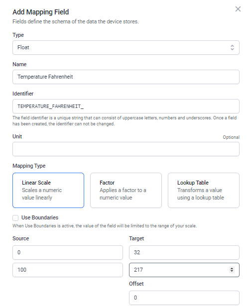

If this is your first time setting up a device between Helium Console and Datacake you'll need to configure the integration. Best to have both websites open in their own window to make flipping back and forth more streamlined. In your Helium Console, navigate to your 'Integrations' window and hit 'Add Integration', and select Datacake.

  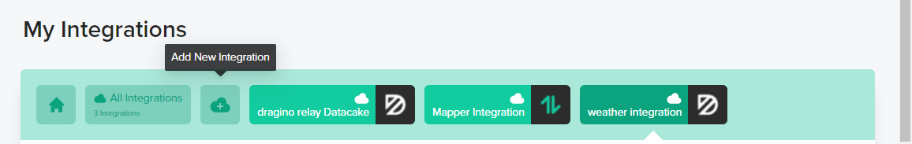 
  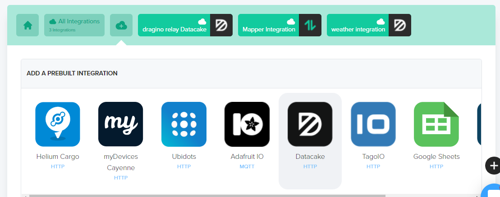 
  
Navigate to your Datacake window and click your User icon in the top left, click Edit Profile, and select API, click 'Show', copy your Datacake Token to your clipboard.

   
  
Navigate back to Helium Console and paste it into your Endpoint Details.

  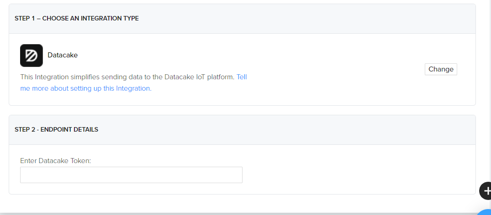 
  
Give it a name, hit 'Add Integration' and copy the Integration ID to your clipboard
 
  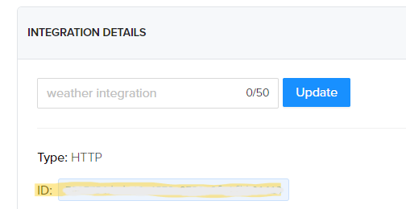  
  
Navigate back over to Datacake, in your Configuration window, and scroll down to 'Network Server', hit 'Configure/Change' and paste your Helium Integration ID into the appropriate field. Copy the Uplink URL to your clipboard

  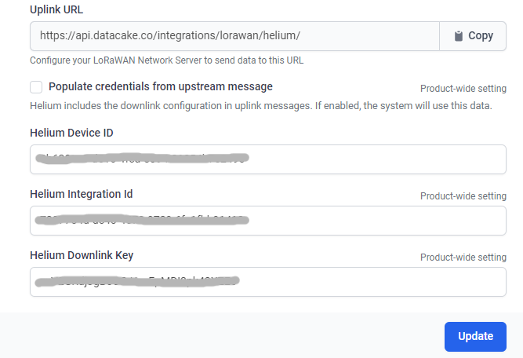 
  
Navigate back to your Helium Console integration and paste the Uplink URL into 'Endpoint URL' field in the UPDATE YOUR CONNECTION DETAILS section.

  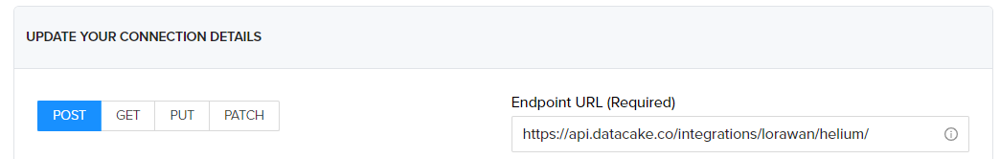 
  
Copy your 'Downlink Key' to your clipboard, and Navigate back to Datacake and paste it into the correct field in the Datacake 'Network Server' window.

  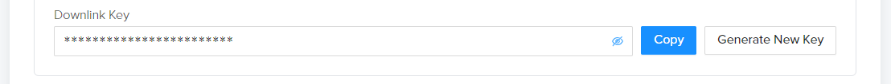 
  
Navigate to your Devices in Helium Console, select your weather monitor and copy the Device ID, scroll down and click 'Update Details'.

  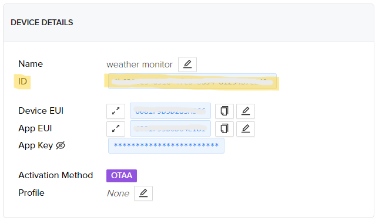 
  
Navigate back to Datacake and paste the Device ID in the correct field in the Datacake 'Network Server' window, and click 'Update'.

  
Head back over to Helium Console and select the 'Flows' tab from the menu on the left hand side of the screen. 
  
  
Now head over to your dashboard and toggle the edit switch in the right of "Permissions" and edit it however you like, this is my configuration. You can duplicate or add fields, and customize their data and appearence really easily. <i>Piece of Datacake!</i>

   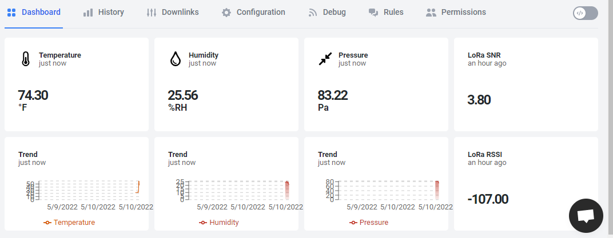
  
Enjoy!

  
<i>(Edit: The LoRa data fields no longer appear to function after editing the code, but again I do not need the data. You'll need to troubleshoot that if you do.)</i>

    
  </body>

</html>
